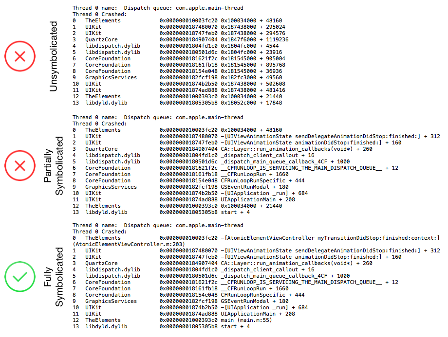

# symbolicate with atos

[https://developer.apple.com/library/archive/technotes/tn2151/_index.html](https://developer.apple.com/library/archive/technotes/tn2151/_index.html)

The same backtrace at various levels of symbolication.


Information from the crash report that is needed to use atos.


```shell
atos -arch arm64 -o TheElements.app.dSYM/Contents/Resources/DWARF/TheElements -l 0x1000e4000 0x00000001000effdc
```